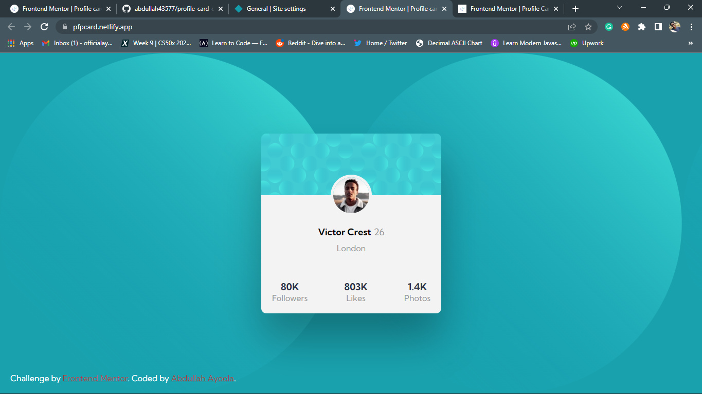

# Frontend Mentor - Profile card component solution

This is a solution to the [Profile card component challenge on Frontend Mentor](https://www.frontendmentor.io/challenges/profile-card-component-cfArpWshJ). Frontend Mentor challenges help you improve your coding skills by building realistic projects.

## Table of contents

- [Overview](#overview)
  - [The challenge](#the-challenge)
  - [Screenshot](#screenshot)
  - [Links](#links)
- [My process](#my-process)
  - [Built with](#built-with)
- [Author](#author)

## Overview

### The challenge

- Build out the project to the designs provided

### Screenshot

### Links

- Solution URL: [Add solution URL here](https://www.frontendmentor.io/solutions/profile-card-component-built-using-flexbox-LqujBXM8x3)
- Live Site URL: [Add live site URL here](https://pfpcard.netlify.app/)

## My process

Desktop-first workflow

### Built with

- Semantic HTML5 markup
- CSS custom properties
- Flexbox
- Desktop-first workflow

## Author

- Website - [Abdullah Ayoola](https://github.com/abdullah43577)
- Frontend Mentor - [@abdullah43577](https://www.frontendmentor.io/profile/abdullah43577)
- Twitter - [@officialayo540](https://twitter.com/officialayo540)
